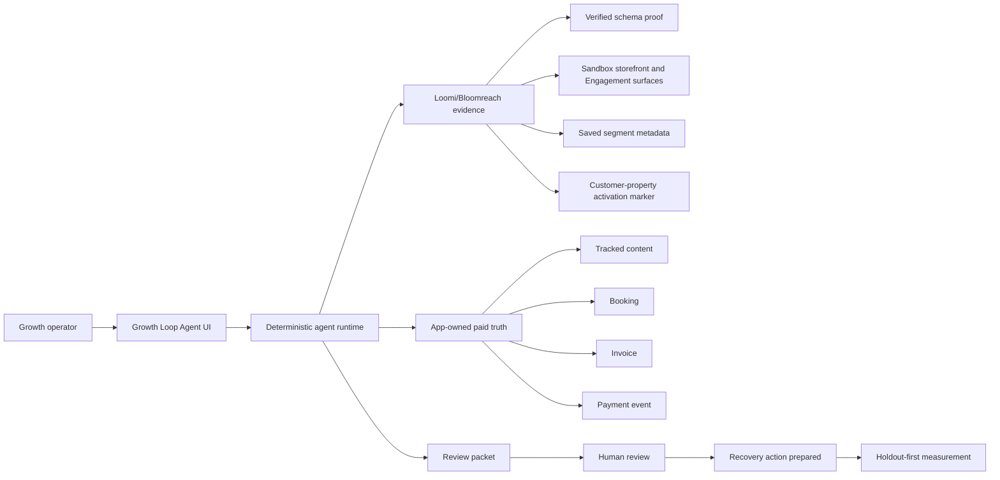

# Growth Loop Track 6 Final Submission Package

## One-Sentence Value Prop

Career Code Pro Growth Loop Agent uses Loomi/Bloomreach engagement intelligence and app-owned paid evidence to prepare one review-ready recovery action with a holdout-first measurement plan.

## Target User

Growth marketers, marketing operations teams, and services teams who need to identify a recovery opportunity and decide what customer-facing action is safe to review next.

## Problem

Engagement signals, campaign opportunities, and revenue proof usually live in different systems. Teams can see activity but still struggle to decide which action is worth reviewing and how to connect it back to paid outcomes.

## Demo Thesis

Most engagement tools can tell you what happened. Career Code Pro connects engagement intelligence to commercial truth, then prepares one reviewed action and a measurement plan.

## 90-Second Demo Narrative

Use this as the opening pass:

> Career Code Pro is a Growth Loop Agent for marketing and growth teams who need to connect engagement intelligence to paid outcomes. The problem is that engagement signals, campaign opportunities, and revenue proof usually live in different systems, so teams can see activity but still struggle to decide what action is worth reviewing next.

> This page shows the Track 6 orchestration path. The runway starts with Loomi/Bloomreach signal proof, then sandbox context, then real Bloomreach Engagement proof objects, then app-owned paid truth, then a review packet and measurement boundary.

> The key design choice is that Loomi and Bloomreach provide engagement intelligence, but the app owns commercial truth. Revenue is counted only through the tracked content, attributed booking, invoice, and payment-event chain.

> The agent inspects paid proof, reads the verified Loomi schema evidence, scores candidate actions, prepares a recovery brief, generates a Bloomreach-ready segment recipe, and attaches a holdout-first measurement plan.

> The output is not an autonomous campaign send. It is a review-ready recovery packet: target segment, message outline, segment recipe, proof chain, and measurement guardrails. A human reviews before anything customer-facing happens.

> This fits Track 6 because the workflow connects engagement context, Bloomreach sandbox proof, app-owned revenue evidence, and human-reviewed action planning into one agentic loop from data to decision to prepared action.

## Five-Minute Demo Structure

1. 0:00-0:30 - Problem and user: growth teams need to connect engagement intelligence to paid outcomes.
2. 0:30-1:15 - Product overview: Growth Loop Agent, Track 6 orchestration, commercial-truth boundary.
3. 1:15-2:00 - Architecture: UI, agent runtime, Loomi/Bloomreach proof, app-owned paid truth, human review.
4. 2:00-3:30 - Core demo: runway, run agent, review packet, segment recipe, measurement plan.
5. 3:30-4:30 - Proof depth: Loomi MCP discovery, sandbox proof, saved segment, activation marker, Reports.
6. 4:30-5:15 - Responsible design: live vs recorded vs deterministic, no external mutation, no lift claim.
7. 5:15-5:45 - Production path: replace recorded proof with runtime connectors, add approval workflow, audit logging, and measurement execution.

## Architecture

## Live, Recorded, Deterministic, And Not Executed

| Layer | Status | Why It Matters |
| --- | --- | --- |
| Loomi MCP schema discovery | Verified through authenticated Cursor MCP proof | Shows the engagement intelligence source that grounds the workflow. |
| Bloomreach saved segment | Real sandbox object, displayed as sanitized metadata | Shows an actual Engagement object proof without page-load mutation. |
| Customer-property activation marker | Real sandbox marker, displayed as sanitized metadata | Shows activation-surface proof without sending a campaign. |
| Storefront / Engagement sandbox | Real sandbox surfaces inspected manually | Shows the retail and Engagement context the recovery loop maps to. |
| Growth Loop Agent run | Deterministic in-app guided workflow | Keeps the judging walkthrough stable and repeatable. |
| Paid revenue evidence | App-owned invoice and payment records | Keeps commercial truth grounded in this app's records. |
| Campaign send / checkout / payment / export mutation | Not executed | Preserves responsible design and avoids unsafe deadline risk. |

## MCP And Bloomreach Usage

### Loomi Connect / MCP

- Cursor-authenticated MCP discovery proved access to the hackathon organization, workspace, and `sleepy-goose` project.
- MCP-derived schema inspection found cart, checkout, purchase, campaign, retargeting, and related event fields.
- Conversation MCP was tested and deferred because it exposed catalog-proxy signals rather than support, checkout, refund, or payment-failure telemetry.

### Bloomreach Engagement

- The real `sleepy-goose` sandbox was inspected in Engagement.
- A real saved segment was created through the Engagement UI: `CCP Cart Recovery Demo - 2026-05-29` / `6a19e7fdf98a9214fd6a5960`.
- A real customer-property activation marker was recorded in Engagement and displayed as sanitized app metadata.

### App-Owned Truth

- Revenue truth remains in Career Code Pro's tracked content, booking, invoice, and payment-event chain.
- Loomi, Bloomreach, Storefront, campaign, and retargeting signals explain context only. They do not count revenue.

## Responsible Design Note

- Uses sandbox/demo data only.
- Does not embed raw customer data, screenshots with secrets, private URLs, cookies, or raw payloads.
- Does not mutate Bloomreach, Storefront, checkout, payment, campaign, or export systems on page load.
- Does not send a recovery message.
- Does not claim lift, causality, statistical confidence, or revenue improvement.
- Requires human review before customer-facing action.
- Counts revenue only through app-owned invoice and payment evidence.

## Backup Screenshot Checklist

Capture these if the live demo environment fails:

- `/app/growth-loop` judge cockpit and Track 6 summary.
- 90-second judge runway.
- Bloomreach saved segment proof card.
- Customer-property activation proof card.
- Review packet.
- Bloomreach-ready segment recipe.
- Measurement plan and no-lift boundary.
- Reports page with the seeded `$195.00` paid result.
- Bloomreach Engagement saved segment list showing `CCP Cart Recovery Demo - 2026-05-29`.
- Engagement customer-property marker proof, sanitized.
- Architecture diagram from this document.

## Claims To Make

- The workflow combines Loomi/Bloomreach engagement context with app-owned paid truth.
- The agent chooses one review-ready recovery action and packages it with proof and measurement guardrails.
- Real Bloomreach sandbox objects were created or inspected where stated.
- The app displays sanitized proof metadata for judging stability.
- Human review and no-mutation boundaries are intentional product design choices.

## Claims To Avoid

- Do not claim Loomi or Bloomreach proved revenue causality.
- Do not claim the app makes a live page-load Loomi or Bloomreach call.
- Do not claim the app creates or updates Bloomreach objects on page load.
- Do not claim the customer-property marker counted revenue.
- Do not claim a live PayPal transaction unless a live PayPal sandbox transaction is separately proven.
- Do not claim lift before holdout outcomes are compared.
